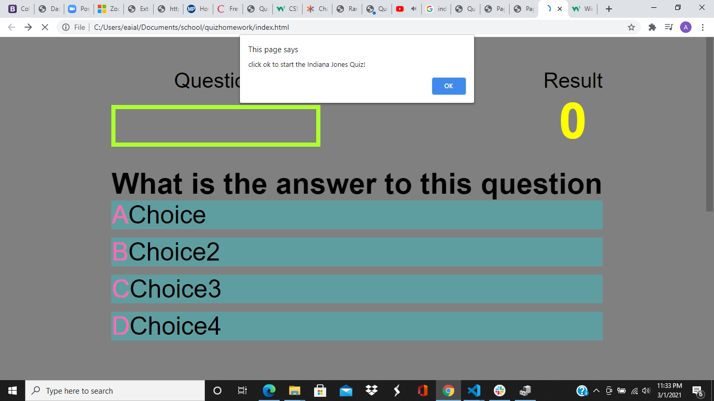
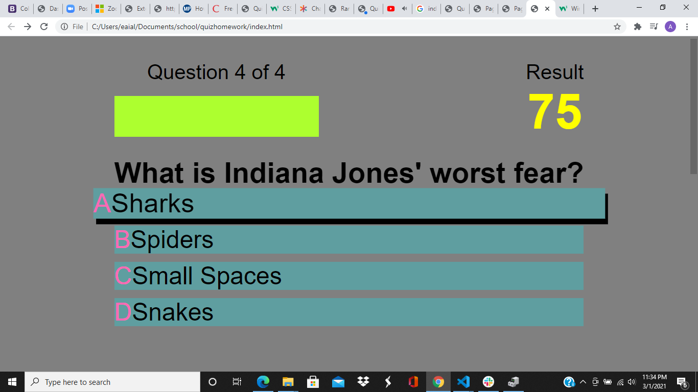
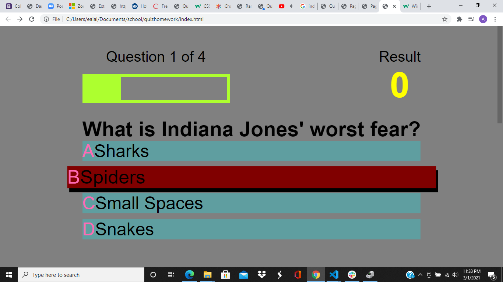
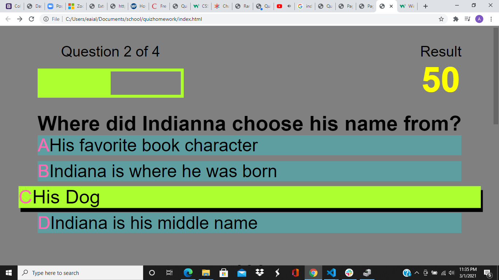

# quizhomework

# Quiz Using Javascript

This project was created with the purpose to learn, practice and properly exicute javascript functions to make a multiple choice quiz.
# Technologies 

This project utilized HTML, CSS, and Javascript languages to perform its task. The majority of the project was focused on the development of the Javascript functions.

# Implementation

When navigated to the Quiz, the user is given the prompts to:

1. Wanted to start the quiz:

They then:

1. Choose their answers:

If Wrong:

1. The answer turned red, and 25pts were not added to the score:

If Correct:
1. The answer turned green and added 25pts.

# Contribute
All contributions are welcome as well as pull requests. Help with work on local storage and timers would be greatly appreciated.

# Credits
Credit goes to Northwestern's Coding Bootcamp instructors for the opportunity to work on this project.

# License
MIT License

Copyright (c) [2021] [Alexandra Grassl]

Permission is hereby granted, free of charge, to any person obtaining a copy
of this software and associated documentation files (the "Software"), to deal
in the Software without restriction, including without limitation the rights
to use, copy, modify, merge, publish, distribute, sublicense, and/or sell
copies of the Software, and to permit persons to whom the Software is
furnished to do so, subject to the following conditions:

The above copyright notice and this permission notice shall be included in all
copies or substantial portions of the Software.

THE SOFTWARE IS PROVIDED "AS IS", WITHOUT WARRANTY OF ANY KIND, EXPRESS OR
IMPLIED, INCLUDING BUT NOT LIMITED TO THE WARRANTIES OF MERCHANTABILITY,
FITNESS FOR A PARTICULAR PURPOSE AND NONINFRINGEMENT. IN NO EVENT SHALL THE
AUTHORS OR COPYRIGHT HOLDERS BE LIABLE FOR ANY CLAIM, DAMAGES OR OTHER
LIABILITY, WHETHER IN AN ACTION OF CONTRACT, TORT OR OTHERWISE, ARISING FROM,
OUT OF OR IN CONNECTION WITH THE SOFTWARE OR THE USE OR OTHER DEALINGS IN THE
SOFTWARE.
